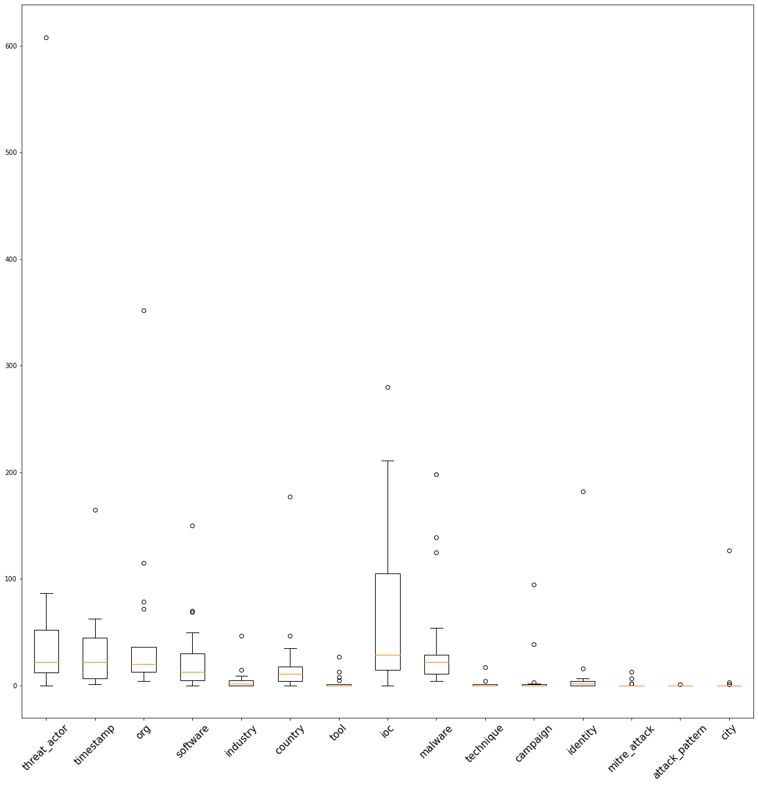
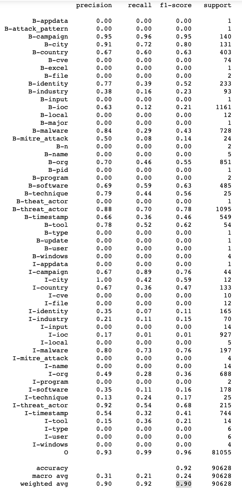
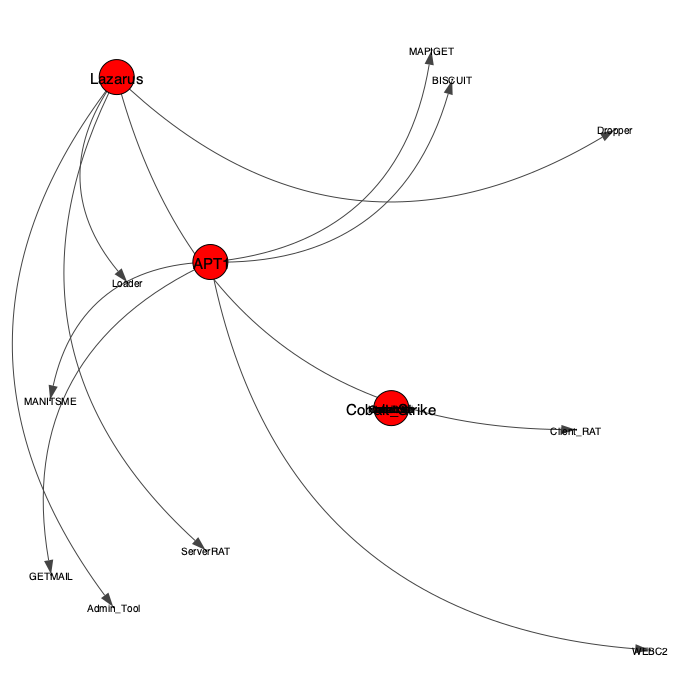

# R-Vision Phystech Genesis Hack 21

# ARES TEAM

**MVP** - http://vispstudio.ru/hack/ares/genesis/v4.html

Project Organization
------------

    ├── LICENSE
    ├── README.md          <- The top-level README for developers using this project.
    ├── data
    │   ├── interim        <- Intermediate data that has been transformed with additional statistic.
    │   ├── processed      <- The final, canonical data sets for modeling.
    │   └── raw            <- The original, immutable data dump.
    │
    │
    ├── models             <- Trained and serialized models, model predictions, or model summaries
    │
    ├── notebooks          <- Jupyter notebooks with data analysis and model training.
    │
    │
    ├── requirements.txt   <- The requirements file for reproducing the analysis environment, e.g.
    │                         generated with `pip freeze > requirements.txt`
    │
    ├── images             <- images with data analysis
    └── src                <- Source code for use in this project.
        │
        ├── regular_app
        └── app            <- Scripts to parse files, share data with frontend, parse texts, get stats
            ├── app.py
            ├── bert.py
            └── w2vRF.py
   

--------
## Установка

1. git clone https://github.com/korney3/ARES_RVision_Hack
2. conda create --name PhGen21 python=3.8
3. conda activate cPhGen21
4. pip install -r requirements.txt
5. Претренированные модели можно скачать [здесь](https://drive.google.com/drive/folders/176t9-TaE9ij90kPciHXS56kZWTX58gCT?usp=sharing)

## Описание проекта

Разработка продукта для аналитиков в сфере ИБ - базы знаний, аггрегирующей источники данных с анализом угроз компьютерной безопасности, справочники с терминами, взаимосвязи между сущностями предметной области.

**Задачи**
1. Создание системы фильтрации источников аналитики по ключевым словам
2. Аннотация новых отчетов для выделения терминов, имеющих отношение к ИБ аналитике и добавления документа в базу знаний
3. Подключение справочных систем (MITR и MISP)
4. Визуализация взаимосвязей между сущностями предметной области ИБ

## Технические особенности

### Проблема №0 (Контраст) - Маленькое количество размеченных данных/Большое число сырых данных и справочной информации

Имеющиеся размеченные данные - маленькие по объему, шумные, классы для аннотирования несбалансированы

[3_baseline_oneHot.ipynb](./notebooks)

Решение: Использование не только моделей глубоко обучения для разметки, но так же и регулярных выражений на основе справочной информации MISP

[EDA данных](./notebooks/1_EDA.ipynb)
[Конвертация данных в IOB формат для построения предсказательных моделей](./notebooks/3_Prepare_data_for_BD.ipynb)

#### Предсказательные модели

1. **Baseline BERT**

В качестве бейзлайна использовалaсь предобученная на корпусе текстов естественного языка модель BERT.

+ Модель хорошо улавливает тэги, присущие естественному языку - `timestamp`, `org`, `country`, `city`
- В присущих узкой области группах терминов модель путается, очень тяжелая для хранение и медленная для предсказаний

Эти выводы хорошо иллюстрирует confusion matrix.

.png)

[Fine-Tuning модели BERT](./notebooks/2_BERT_Baseline.ipynb)

2. **Word2Vec+RandomForest**

+ Быстрая, легкая модель
- Точность значительно уменьшается в сравнении с более продвинутым BERT

При этом на одной из самых интересующих сущностей (`treat-actor`) модель демонстрирует сравнительно неплохие метрики.

[Обучение модели W2Vec и RF](./notebooks/5_Word2VecClassification.ipynb)

Сравнение метрик качества моделей:

Для валидации была отложена 0.2 часть выборки.

|Model| F1 weighted      | F1 macro  | 
| ------------- |:------------------:| :------------------:| 
| BERT     |  **0.96**  | **0.59** |
| Word2Vec+RF  | **0.90** |  **0.24** |

3. Регулярные выражения и [кластеры MISP](https://github.com/MISP/misp-galaxy)

Для разметки текстов регулярными выражениями мы воспользовались кластерами MISP, относящимися к `treat_actor, malware, techniques`, собрав всевозможные синонимы для угроз, чтобы максимизировать точность поиска таких ключевых слов по аналитическим отчетам.

При помощи регулярных выражений в **0.64** сырых статей можно найти `treat_actor`, а в **0.9** -  `malware, 'techniques`.

Кроме того кластеры MISP связаны с дополнительным источником информации MITR, куда можно напрямую обращаться за информацией по потенциальным уязвимостям или подверженным конкретной атаке ОС.

#### Поиск связей между сущностями

1. Справочные данные

Кластеры MISP содержут набор синонимов различных терминов из сферы ИБ, позволяя объединять различные названия одного и того же процесса и облегчая поиск отчетов по схожей тематике.

2. Размеченный датасет

Считая наиболее часто встречающуюся сущность за тему документа, можно выделить ее особенные признаки - из других ключевых слов. часто появляющихся рядом. Сущности-темы документов (скажем, виды атак) затем можно сравнивать, находя пересечения техник, способов захвата или уязвимостей.

На основе имеющихся размеченных данных сложно получить достаточно информации, но, при наличии бОльшего числа разметок, этот алгоритм мог бы стать информативнее.

3. Word2Vec

Обучение без учителя на совместном корпусе размеченных и неразмеченных данных позволяет отслеживать интересные взаимосвязи между сущностями из разных категорий, потенциально приводя к обнаружению устойчивых закономернотей между уязвимостями, атаками и используемым вирусным ПО.

Полноценное облако точек можно увидеть [здесь](http://projector.tensorflow.org/?config=https://gist.githubusercontent.com/korney3/d483d702875f1037966f67e76e9256a1/raw/794b723b3f2ed8d0039731e333e03f2e4ca50dbd/gistfile1.txt) (время загрузки 10-15 минут).
 
#### Выводы

Для полученных моделей были посчитаны метрики качества - **accuracy**, **recall**, **f1_score**.

Поскольку разметки для всех данных нет, из общего корпуса отзывов были случайно выбраны и размечены 400 отзывов. При этом в соответствие каждому отзыву ставилось сразу несколько классов, поскольку отзывы потенциально содердат в себе проблемы, относящиеся к разным командам.

Размеченные данные в IOB формате лежат в файле [IOB_dataset_format.csv](./data/interim/IOB_dataset_format.csv)

1. Использованные нами подходы в основном превосходят результаты бейзлайна (**Keywords matching**)

2. Несмотря на то, что по средним значениям метрик наилучшие предсказания дает **One-Hot vectorization**, стандартное отклонение показывает, что не претренированная модель сравнима по скорам с моделями и **Flair embeddings** and **BERT embeddings**.

3. **Flair embeddings** and **BERT embeddings** позволяют **без переобучения модели** добавлять новые команды с их ключами и делать предсказания сразу же.

### Проблема №2 - Отсутствие разметки для классификации по тональности
Довольно проблематично найти датасет русскоязычных отзывов с размеченной тональностью. Поэтому для обучения модели тональности, мы использовали русскоязычный датасет с твитами. После обучения и тестирования модели, нам удалось достигнуть качества в 75% по метрике accuracy.

### Проблема №3 Объединение отзывов по темам

1. **Tематическое моделирование** - это статистический метод обработки текстовой информации на естественном языке, позволяющий в процессе моделирования устанавливаются распределения документов над темами и тем над отдельными словами.

Одним из классических представителей алгоритмов тематического моделирования является LDA (Latent Dirichlet Allocation). В случае LDA каждый документ в корпусе характеризуется распределением Дирихле над скрытыми (латентными) переменными (темами), и каждая тема характеризуется другим распределением Дирихле по всем отдельным словам словаря.

Таким образом каждый документ представляет собой смесь различных тем, каждая тема формируется своим набором терминов.

В отличие от традиционного Bag-of-word подхода для извлечения текстовых объектов мы не получаем большую разреженную матрицу терм-документ, содержащую много «шумной» информации, а выстраиваем мосты между отдельными словами и документами через скрытые тематики и мягкую кластеризацию, выполняя попутно операцию снижения признакового пространства.
 
Подобрать оптимальное число тематик позволяют текие метрики как
Сложность (Perplexity) модели и согласованность (Coherence) тем построенной модели.

Файл с кодом можно посмотреть [8_topic_modeling.ipynb](https://github.com/korney3/SberCodeKeyIdea/blob/master/Code/8_topic_modeling.ipynb)

Результаты визуализации [lda_2.html](https://github.com/korney3/SberCodeKeyIdea/blob/master/Presentation%20materials/lda_2.html)

**Выводы**: По итогу тематического моделирования было построено выделение тем из датасета с отзывами

2. **KMeans кластеризация**

На базе векторов **Flair embeddings** and **BERT embeddings** была сделана попытка определить оптимальное количество кластеров, на которые можно было бы разбить все отзывы при помощи **Elbow method**

|Embeddings| Elbow method      | PSA reduced clusterization  | 
| ------------- |:------------------:| -----:|
| Flair     |     |  |
| Bert   |  |   |

**Выводы**: Наилучшее количество кластеров очень мало для выделения тем - ~5 кластеров для обоих типов эмбеддингов

3. **KMeans кластеризация по релизам**

В качестве идеи мы рассмотрели возможную кластеризацию среди отзывов в рамках одного релиза.

## Контакты

Egor Yusupov - Front-end, Design - @EgorYusupov

Max Egorov  - Data Scientist - @egorov_m

Alisa Alenicheva  - Data Scientist - @korney3

